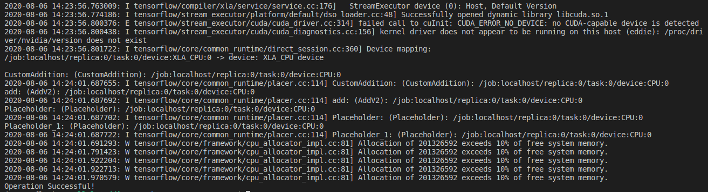

# Cpp-Capstone (Tensorflow Custom Op) Project
---

In this project we will create a custom op that isn't covered by existing Tensorflow Library. Following project is created by following instructions provided by [Tensorflow](https://www.tensorflow.org/), in the [Create an op](https://www.tensorflow.org/guide/create_op) page.

[Prerequisites](#Prerequisites)
---
### Tensor Addition Op
Addition op is an op that gets two tensors as input and outputs a tensor that is summation of input tensors.

Following is the Functor of Addition Op
```
template<typename T>
struct AdditionFunctor<CPUDevice,T>{
    void operator()(const CPUDevice& d, const T* input_a, const T* input_b, T* output_c, int N){
        for(int i=0;i<N; i++){
            output_c[i] = input_a[i] + input_b[i];
        }
    }
};
```
Output tensor c is summation of input tensor a and b.

---
### Building the op Library
First of all, using python, we will get the header directory and the get_lib directory.
```
$ python
>>> import tensorflow as tf
>>> tf.sysconfig.get_include()
>>> tf.sysconfig.get_lib()
```

### Compile
#### Compile with CPU Device
Run following codes to compile custom op into a dynamic library.
```
TF_CFLAGS=( $(python -c 'import tensorflow as tf; print(" ".join(tf.sysconfig.get_compile_flags()))') )
TF_LFLAGS=( $(python -c 'import tensorflow as tf; print(" ".join(tf.sysconfig.get_link_flags()))') )
g++ -std=c++11 -shared zero_out.cc -o zero_out.so -fPIC ${TF_CFLAGS[@]} ${TF_LFLAGS[@]} -O2
```

* Note on gcc version >=5: gcc uses the new C++ ABI since version 5. The binary pip packages available on the TensorFlow website are built with gcc4 that uses the older ABI. If you compile your op library with gcc>=5, add -D_GLIBCXX_USE_CXX11_ABI=0 to the command line to make the library compatible with the older abi.

#### Compile with GPU Device
Using CUDA kernel to implement op. 
```
nvcc -std=c++11 -c -o cuda_op_kernel.cu.o cuda_op_kernel.cu.cc \
  ${TF_CFLAGS[@]} -D GOOGLE_CUDA=1 -x cu -Xcompiler -fPIC

g++ -std=c++11 -shared -o cuda_op_kernel.so cuda_op_kernel.cc \
  cuda_op_kernel.cu.o ${TF_CFLAGS[@]} -fPIC -lcudart ${TF_LFLAGS[@]}
```

### Testing through python
Compile with testing file in python code.
```
python customAdd_test.py
```
When operation is successfully done, you will see 
```
Operation Successful!
```
---
### Testing Result 


---
### Prerequisites
- [Tensorflow binary](https://www.tensorflow.org/install)
- g++ 
- CUDA if running with GPU Device

